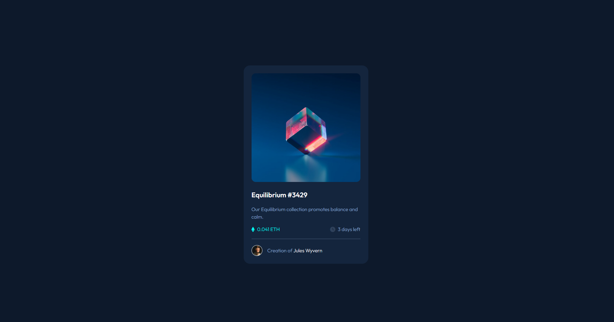

# Frontend Mentor - NFT preview card component solution

This is a solution to the [NFT preview card component challenge on Frontend Mentor](https://www.frontendmentor.io/challenges/nft-preview-card-component-SbdUL_w0U). Frontend Mentor challenges help you improve your coding skills by building realistic projects. 

## Table of contents

- [Overview](#overview)
  - [The challenge](#the-challenge)
  - [Screenshot](#screenshot)
  - [Links](#links)
- [My process](#my-process)
  - [Built with](#built-with)
  - [What I learned](#what-i-learned)
  - [Continued development](#continued-development)
  - [Useful resources](#useful-resources)
- [Author](#author)
- [Acknowledgments](#acknowledgments)

## Overview

### The challenge

Users should be able to:

- View the optimal layout depending on their device's screen size
- See hover states for interactive elements

### Screenshot

### Links

- Solution URL: [Solution](https://htmlpreview.github.io/?https://github.com/ilhanhakan-koc/frontend_nft_challenge/blob/main/index.html)

## My process

### Built with

- Semantic HTML5 markup
- CSS custom properties
- Flexbox
- Mobile-first workflow

### What I learned

The use of flex. I was able to place elements easily with flex. With more projects I will be able to master flex and grid. 

### Continued development

In the next projects I will try to focus on flex and grid. Always trying to implement complex solutions where I can do the same thing with the simple usage of flex and grid.

### Useful resources

- [Google](https://www.google.com) - :)

## Author

- Frontend Mentor - [@ilhanhakan-koc](https://www.frontendmentor.io/profile/ilhanhakan-koc)

## Acknowledgments

As always a big thanks to frontend mentor. Learning new technologies during a full time job :)
